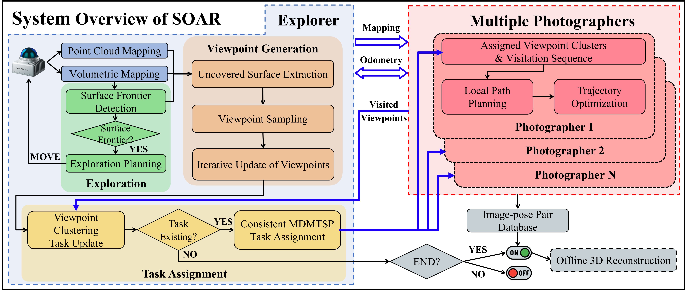

<div align="center">
    <h2>SOAR: Simultaneous Exploration and Photographing with Heterogeneous UAVs for Fast Autonomous Reconstruction</h2>
    <strong>IROS 2024 Oral</strong>
    <br>
        <a href="http://sysu-star.com/people" target="_blank">Mingjie Zhang</a><sup>1,3,*</sup>,
        <a href="https://chen-albert-feng.github.io/AlbertFeng.github.io" target="_blank">Chen
            Feng</a><sup>2,*</sup>,
        <a href="http://sysu-star.com/people" target="_blank">Zengzhi Li</a><sup>1,4</sup>,
        <a href="http://sysu-star.com/people" target="_blank">Guiyong Zheng</a><sup>1</sup>,
        <a href="http://sysu-star.com/people" target="_blank">Yiming Luo</a><sup>1</sup>,
        <br>
        <a href="https://zdh.ncepu.edu.cn/szdw/fjs/2e5352e61fb648aa890d5aaaf1f1447f.htm" target="_blank">Zhu
            Wang</a><sup>4</sup>,
        <a href="https://facultyprofiles.hkust-gz.edu.cn/faculty-personal-page/ZHOU-Jinni/eejinni"
            target="_blank">Jinni Zhou</a><sup>5</sup>,
        <a href="https://uav.hkust.edu.hk/group" target="_blank">Shaojie Shen</a><sup>2</sup>,
        <a href="http://sysu-star.com/people" target="_blank">Boyu Zhou</a><sup>1,†</sup>
        <p>
        <h45>
            <sup>1</sup> Sun Yat-Sen University. &nbsp;&nbsp;
            <sup>2</sup> The Hong Kong University of Science and Technology. &nbsp;&nbsp;
            <br>
            <sup>3</sup> Northwestern Polytechnical University. &nbsp;&nbsp;
            <sup>4</sup> North China Electric Power University. &nbsp;&nbsp;
            <br>
            <sup>5</sup> The Hong Kong University of Science and Technology(Guang Zhou). &nbsp;&nbsp;
            <br>
        </h45>
        <sup>*</sup>Equal Contribution &nbsp;&nbsp;
        <sup>†</sup>Corresponding Authors
    </p>
    <a href="https://arxiv.org/abs/2409.02738"></a>
    <a href='https://sysu-star.github.io/SOAR'></a>
    <a href="https://www.bilibili.com/video/BV1G1421Q79m/"></a>
</div>

## System Overview

<div align=center></div>

## Citation

If you find this work useful in your research, please consider citing:

```bibtex
@article{zhang2024soar,
  title={SOAR: Simultaneous Exploration and Photographing with Heterogeneous UAVs for Fast Autonomous Reconstruction},
  author={Zhang, Mingjie and Feng, Chen and Li, Zengzhi and Zheng, Guiyong and Luo, Yiming and Wang, Zhu and Zhou, Jinni and Shen, Shaojie and Zhou, Boyu},
  journal={arXiv preprint arXiv:2409.02738},
  year={2024}
}
```

## 🤗 FC-family Works

#### 1. What is FC-family?

We aim to develop intelligent perception-centric flight to realize ***F***ast ***C***overage / re***C***onstruction / inspe***C***tion etc.

#### 2. Projects list

* [PredRecon](https://github.com/HKUST-Aerial-Robotics/PredRecon) (ICRA2023): Prediction-boosted Planner for Aerial Reconstruction.
* [FC-Planner](https://github.com/HKUST-Aerial-Robotics/FC-Planner) (ICRA2024): Highly Efficient Global Planner for Aerial Coverage.
* [SOAR](https://github.com/SYSU-STAR/SOAR) (IROS2024): Heterogenous Multi-UAV Planner for Aerial Reconstruction.

## Todo

For **more information**, please pay more attention to our [**project homepage**](https://sysu-star.github.io/SOAR) (\*^▽^\*).


Code will come soon~~~
